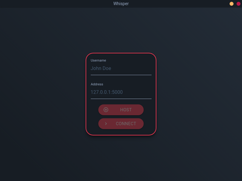
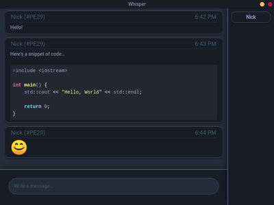

    

### What is it?
Whisper is a program that allows you to either host or directly connect to a chatroom that can be used to talk privately with your peers.

### Why?
I chose to write Whisper for the final project of my high school's computer science course, in which we were assigned
to develop and bring to life any application of our choice in an organized and documented manner.

When I started this project, I had very little knowledge of the many tools I was planning to use and was learning a lot as I went along. As a result of this, I'm not all too happy with the quality of this project's codebase, as it's fairly hacky and unmaintainable in it's current state.

With that being said, I am still quite proud of the overall look and feel of the program and am happy with how it turned out, which is why I am choosing to share it here.

### Screenshots
 